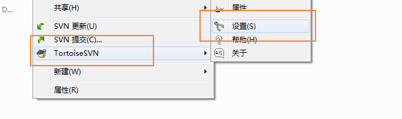
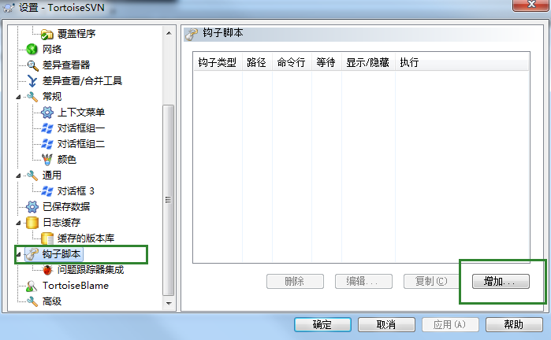
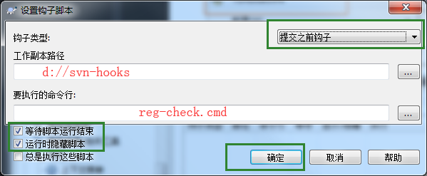

# Reg-check-pre-commit

> check your code in svn pre-commit

## 如何使用

1. 将`hooks`路径下两个文件保存到本地（比如 D://svn-hooks）;
2. 在svn项目目录中选择svn设置  
   
3. 找到`钩子脚本`->`增加`  
   
4. 录入hook配置  
   

> 如果需要定制校验规则，可将hook放到项目目录下，修改`reg-check-pre-commit.js`  

```javascript
// 需要校验的文件后缀名
var needCheckSuffixs = [".js"];
// 需要校验的目录
var needCheckFilePaths = ["../src"];
// 需要校验的规则
// prettier-ignore
var needCheckRegs = ["\\s+(const|let)\\s","\s+=>",]

```